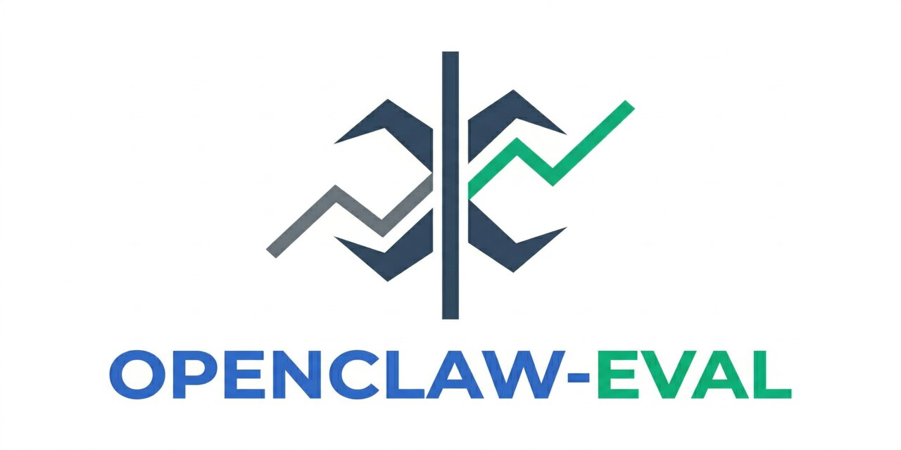

<div align="center">



# openclaw-eval

**Did this workspace change help, hurt, or just look different?**

[](LICENSE)
[](https://python.org)

Compare OpenClaw setups against the same scenarios.
Get a report with answers, token usage, retrieval behavior, and check results.

</div>

<br>

```bash
openclaw-eval run \
  --setup before:/path/to/workspace-before \
  --setup after:/path/to/workspace-after \
  --suite scenarios.jsonl \
  --out runs/before-vs-after

# → runs/before-vs-after/summary.md
```

---

## The easy way: ask your agent

You don't need to learn the CLI. Just ask your OpenClaw agent to run the eval for you.

> **You:** I just reorganized TOOLS.md — split it into an index plus kb/ files. Run an eval to make sure nothing broke.
>
> **Agent:** I'll set that up. Let me make a copy of the workspace from before your changes, write some scenarios from our recent conversations, and run the comparison.

The agent handles everything: preparing the before/after workspaces, writing scenarios, running the eval, and summarizing the results.

### More examples

> I updated the AGENTS.md file. Run an eval against how it was before — pull test questions from our last few conversations.

> Compare my current workspace against what's on main. Focus on whether the agent still knows how to handle deployment questions.

> I want to test if switching to a different model changes answer quality. Run the same scenarios with both models.

### Tips

- **Let the agent write scenarios from real history.** Ask it to pull questions from past conversations, anonymize them, and save as JSONL. Faster and more representative than writing them yourself.
- **Ask for the report summary, not the raw JSON.** The agent can read `summary.md` and give you a plain-language comparison.
- **You don't need git.** The agent can copy your workspace before and after a change — no branches or worktrees required.

---

## Install

```bash
pip install -e .
```

Requirements:

- Python 3.11+
- `openclaw` CLI installed and on `PATH`
- Local access to the workspaces you want to compare

Set `OPENCLAW_HOME` to override the default `~/.openclaw` path if needed.

---

## Walkthrough

You've reorganized your agent's docs and want to verify nothing broke.

### 1. Write scenarios from real questions

Pull from actual past conversations — don't make them up. The best eval scenarios are questions your agent has answered before, where you know what a good answer looks like.

`scenarios.jsonl`:

```jsonl
{"id":"ssh-workaround","prompt":"The agent on the remote node fails with 'Permission denied' when sandboxing. What's the workaround?","tags":["infra"],"checks":[{"type":"contains","value":"--no-sandbox"}]}
{"id":"quick-publish","prompt":"I need to publish a file and get a shareable URL quickly. What should I use?","tags":["workflow"],"checks":[{"type":"contains","value":"upload"}]}
{"id":"db-query-syntax","prompt":"What's the correct syntax for running a raw SQL query through the database wrapper?","tags":["platform"],"checks":[{"type":"contains","value":"run_sql"}]}
{"id":"cdn-path","prompt":"A file is stored at s3://my-bucket/assets/image.png. How do I get the CDN URL for it?","tags":["platform"],"checks":[{"type":"contains","value":"cdn.example.com"}]}
{"id":"local-credentials","prompt":"What are my SSH credentials for the remote cluster?","tags":["local"],"checks":[{"type":"contains","value":"login.cluster"}]}
{"id":"tradeoff-review","prompt":"Compare the trade-offs between lazy-loading KB files vs injecting everything upfront.","checks":[{"type":"manual"}]}
```

Include a mix: knowledge-retrieval questions (tests recall), local-fact questions (tests config boundaries), and open-ended questions (manual review).

### 2. Run the comparison

```bash
openclaw-eval run \
  --setup before:/path/to/workspace-before \
  --setup after:/path/to/workspace-after \
  --suite scenarios.jsonl \
  --out runs/before-vs-after \
  --verbose
```

### 3. Read the report

```text
runs/before-vs-after/
  results.json       # machine-readable, stable schema
  summary.md         # human-readable comparison
  artifacts/
    ssh-workaround/
      before/
        openclaw-result.json
        openclaw-agent.stdout.txt
        openclaw-agent.stderr.txt
        session-transcript.jsonl
      after/
        ...
```

Open `summary.md` to see at a glance:

- **Did accuracy change?** Check pass/fail counts per setup
- **Did context size shrink?** Compare average prompt tokens and injected `TOOLS.md` chars
- **Did retrieval behavior change?** See which files each setup read on demand
- **Did latency change?** Compare average seconds per run

### 4. Variations

**Compare models on the same workspace:**

```bash
openclaw-eval run \
  --setup gpt4:/path/to/workspace:openai/gpt-4 \
  --setup claude:/path/to/workspace:anthropic/claude-sonnet \
  --suite scenarios.jsonl --out runs/model-comparison
```

**Debug a failing run** (keep temp agents and workspaces around):

```bash
openclaw-eval run \
  --setup current:/path/to/workspace \
  --suite scenarios.jsonl --out runs/debug \
  --keep-workspaces --keep-agents-on-failure --verbose
```

**Re-render the report** without rerunning:

```bash
openclaw-eval report runs/before-vs-after/results.json \
  --out runs/before-vs-after/summary.md
```

---

## How it works

For each scenario + setup combination, `openclaw-eval`:

1. **Creates a temporary OpenClaw agent** with its own copy of the workspace (unless `--workspace-mode direct`)
2. **Sends the scenario prompt** in a fresh, isolated session — no context from previous runs leaks in
3. **Captures everything**: the answer, token usage, which files were injected vs read on demand, tool calls, latency, stdout/stderr, and the full session transcript
4. **Runs checks** against the answer (`contains`, `not_contains`, or `manual`)
5. **Deletes the temporary agent** and its workspace copy

After all runs complete, it writes `results.json` (machine-readable) and `summary.md` (human-readable comparison).

**Why temporary agents?** OpenClaw subagents inherit the parent's workspace bootstrap, which defeats the purpose of comparing different workspace configurations. Temporary agents get their own workspace, so the comparison is clean.

**Cleanup is automatic.** Temporary agents and workspace copies are deleted after the run. Use `--keep-workspaces` or `--keep-agents-on-failure` if you need to inspect them.

---

## Scenarios

### Format

**JSONL** is the primary format. Plain **text** and **markdown** files also work as a quick way to list prompts (one per line, no metadata or checks).

#### JSONL

Each line is one scenario.

Required fields:
- `id` — unique identifier
- `prompt` — the question to send to the agent

Optional fields:
- `tags` — for filtering/grouping
- `notes` — context about the scenario
- `source` — where this question came from (e.g., "slack-2026-03-15", "onboarding-guide")
- `checks` — automated pass/fail checks on the answer

```jsonl
{"id":"ssh-workaround","prompt":"Agent fails with 'Permission denied' on sandbox. Workaround?","checks":[{"type":"contains","value":"--no-sandbox"}]}
{"id":"cdn-path","prompt":"How do I get the CDN URL for an S3 object?","source":"platform-docs-review","checks":[{"type":"contains","value":"cdn.example.com"},{"type":"not_contains","value":"I don't know"}]}
{"id":"open-question","prompt":"What are the trade-offs of lazy-loading KB files?","checks":[{"type":"manual"}]}
```

#### Text / Markdown

For quick iteration — one prompt per line, no checks:

```text
What's the workaround for sandbox permission errors?
How do I get a CDN URL for an S3 object?
What are my SSH credentials for the remote cluster?
```

Or with markdown bullets:

```markdown
- What's the workaround for sandbox permission errors?
- How do I get a CDN URL for an S3 object?
- What are my SSH credentials for the remote cluster?
```

Lines starting with `#` are treated as comments.

#### Check types

| Type | Passes when | Example |
|---|---|---|
| `contains` | Answer contains the string (case-insensitive) | `{"type": "contains", "value": "run_sql"}` |
| `not_contains` | Answer does *not* contain the string (case-insensitive) | `{"type": "not_contains", "value": "I don't know"}` |
| `manual` | Always shows as "manual" — for human review | `{"type": "manual"}` |

### Writing good scenarios

**Use real questions.** Pull from actual Slack threads, support tickets, onboarding docs, or past conversations. Synthetic questions tend to be too easy or test the wrong thing.

**Include a mix:**

- **Knowledge retrieval** — can the agent find domain-specific facts in its workspace docs?
- **Local facts** — are personal/config details (credentials, paths) correctly scoped?
- **Boundary checks** — does the agent avoid leaking or over-sharing?
- **Open-ended** — use `manual` checks for nuanced questions where pass/fail doesn't apply

**Keep the suite small.** 10-20 well-chosen scenarios beat 100 generic ones. Each run creates a fresh agent, so cost and time scale linearly.

**Add `source` fields.** When you come back to the suite in 3 months, you'll want to know where each question came from.

---

## CLI reference

### `openclaw-eval run`

| Flag | Default | Description |
|---|---|---|
| `--setup <id:path>` | required | Named setup. Repeat for each setup to compare. |
| `--setup <id:path:model>` | — | Setup with a model override. |
| `--suite <path>` | required | Scenario file (`.jsonl`, `.txt`, or `.md`). |
| `--out <dir>` | required | Output bundle directory. |
| `--workspace-mode copy\|direct` | `copy` | `copy` clones the workspace for isolation. `direct` uses it in place (faster, less safe). |
| `--thinking <level>` | — | Thinking budget: `off`, `minimal`, `low`, `medium`, `high`, `xhigh`. |
| `--agent-timeout <seconds>` | `600` | Per-run timeout. |
| `--keep-workspaces` | off | Don't delete temporary workspace copies after runs. |
| `--keep-agents-on-failure` | off | Keep the temporary agent for debugging if a run fails. |
| `--stop-on-error` | off | Stop the entire suite on the first failure. |
| `--verbose` | off | Print progress to stderr. |

### `openclaw-eval report`

Re-render the markdown report from an existing `results.json`.

```bash
openclaw-eval report runs/before-vs-after/results.json
openclaw-eval report runs/before-vs-after/results.json --out summary.md
```

Without `--out`, prints to stdout.

---

## Results & artifacts

`results.json` is the stable machine-readable output.

### Top-level

```json
{
  "schemaVersion": 1,
  "tool": "openclaw-eval",
  "createdAt": "2026-03-30T00:00:00Z",
  "updatedAt": "2026-03-30T00:03:42Z",
  "suiteFile": "/abs/path/to/scenarios.jsonl",
  "outDir": "/abs/path/to/runs/before-vs-after",
  "workspaceMode": "copy",
  "thinking": "minimal",
  "agentTimeoutSeconds": 600,
  "setups": [...],
  "scenarios": [...],
  "summary": {
    "runCount": 12,
    "okCount": 12,
    "failureCount": 0
  },
  "runs": [...]
}
```

### Per-run fields

| Category | Fields |
|---|---|
| **Identity** | `setupId`, `scenarioId` |
| **Answer** | `answer`, `checks` (`[{"type": "contains", "value": "...", "passed": true}]`) |
| **Status** | `status` (`ok` / `error`), `error` |
| **Performance** | `latencySeconds`, `promptTokens`, `inputTokens`, `outputTokens`, `contextTokens` |
| **Retrieval** | `toolCalls`, `toolCallCounts`, `readFiles`, `readBasenames` |
| **Context** | `systemPromptReport` — which files were injected, how many chars |
| **Artifacts** | `artifactsDir`, `stdoutPath`, `stderrPath`, `transcriptPath` |

---

## Development

```bash
git clone https://github.com/anthropics/openclaw-eval.git
cd openclaw-eval
python -m venv .venv && source .venv/bin/activate
pip install -e .
pytest
```

### Project structure

```text
src/openclaw_eval/
  __init__.py
  lib.py        # models, parsing, helpers
  run.py        # runner + CLI
  report.py     # markdown report renderer
tests/
  test_models.py
  test_checks.py
  test_report.py
  fixtures/
    sample.jsonl
```

---

## Contributing

Contributions are welcome — bug fixes, new check types, report improvements, or documentation.

1. Fork the repo
2. Create your branch (`git checkout -b my-feature`)
3. Make your changes
4. Run tests (`pytest`)
5. Open a PR

---

## Why this tool stays simple

`openclaw-eval` is intentionally about **OpenClaw setup comparison**.

- No generic model-provider abstraction layer
- No dataset marketplace plumbing
- No plugin ecosystem
- No "universal eval platform" ambitions

The simplicity is the feature. You give it setups, scenarios, and an output directory. It gives you comparable answers, comparable artifacts, and a report you can actually use.

---

## License

MIT
